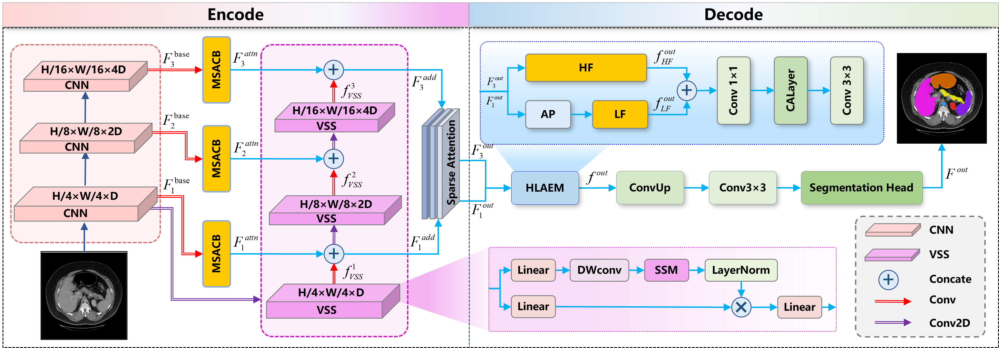

# MSSMamba: Hybrid Multi-scale Spatial-State Mamba with Frequency-Adaptive Boundary Refinement for Medical Image Segmentation

## Abstract

In recent years, Mamba, an innovative state-space model (SSM), has demonstrated significant potential in medical image segmentation by achieving linear computational complexity relative to sequence length. While Mamba efficiently captures long-range contextual dependencies, precise medical image segmentation requires not only global context but also the preservation of fine lesion details and boundary accuracy. Traditional CNN models are limited by their local receptive fields,  whereas the Transformer architecture, despite enhancing global modeling, introduces artifacts at pixel boundaries due to its patch-based image tokenization. To address these limitations, we propose a Hybrid Multi-scale Spatial-State Mamba with Frequency-Adaptive Boundary Refinement (MSSMamba) for medical image segmentation, synergizing CNN-based local feature extraction with Mamba's global context modeling capability. Specifically, we design a three-layer pyramid structure, where the CNN is responsible for extracting detailed local features, and Mamba captures the global context information effectively through state space modeling, avoiding the structural breakage problem caused by the transformer chunking operation. Furthermore, the framework effectively fuses local and global features and enhances the segmentation accuracy by designing a Multi-scale Attention Convolutional Block (MSACB) and a High-Low Frequency Adaptive Enhancement Module (HLAEM). Extensive experiments on the Synapse, ISIC17/18, and AVT datasets demonstrate that MSSMamba outperforms existing methods, particularly in segmenting small lesions and complex anatomical backgrounds.

## 1.Main Environments

Establish the Mamba environment used in this paper

    conda create -n mssmamba python=3.8
    conda activate mssmamba
    pip install torch==1.13.0 torchvision==0.14.0 torchaudio==0.13.0 --extra-index-url https://download.pytorch.org/whl/cu117
    pip install packaging
    pip install timm==0.4.12
    pip install pytest chardet yacs termcolor
    pip install submitit tensorboardX
    pip install triton==2.0.0
    pip install causal_conv1d==1.0.0  # causal_conv1d-1.0.0+cu118torch1.13cxx11abiFALSE-cp38-cp38-linux_x86_64.whl
    pip install mamba_ssm==1.0.1  # mmamba_ssm-1.0.1+cu118torch1.13cxx11abiFALSE-cp38-cp38-linux_x86_64.whl
    pip install scikit-learn matplotlib thop h5py SimpleITK scikit-image medpy yacs

The .whl files of causal\_conv1d and mamba\_ssm could be found here. [Baidu](https://pan.baidu.com/s/1Kn2AfMQDBcHmG2FJtb53Eg?pwd=61ip )

## 2.Prepare the pre\_trained weights

*   The weights of the pre-trained Mamba could be downloaded from [Baidu](https://pan.baidu.com/s/1nKhZVHFrClofA-PUl77WSQ?pwd=ndm7 ). After that, the pre-trained weights should be stored in './weights/'.

## 3. Prepare the dataset

#### Synapse datasets

*   For the Synapse dataset, you could follow [Swin-UNet](https://github.com/HuCaoFighting/Swin-Unet) to download the dataset, or you could download them from [Baidu](https://pan.baidu.com/s/1Ja2pzi7QhNV-Rf1dfRL8RA?pwd=8hb9 ).

*   After downloading the datasets, you are supposed to put them into './data/Synapse/', and the file format reference is as follows.

*   './data/Synapse/'

    *   lists

        *   list\_Synapse

            *   all.lst

            *   test\_vol.txt

            *   train.txt

    *   test\_vol\_h5

        *   casexxxx.npy.h5

    *   train\_npz

        *   casexxxx\_slicexxx.npz

#### ISIC datasets

*   The ISIC17 and ISIC18 datasets, divided into a 7:3 ratio, can be found here.[Baidu](https://pan.baidu.com/s/1GMZE1KwODTnYLbsCspos9A?pwd=61w7 )

*   After downloading the datasets, you are supposed to put them into './data/isic17/' and './data/isic18/', and the file format reference is as follows.

*   './data/isic17/'

    *   train

        *   images

            *   .png

        *   masks

            *   .png

    *   val

        *   images

            *   .png

        *   masks

            *   .png

## 4.Train/Test

Taking the Synapse dataset as an example.

1.  Run the following code to install the Requirements.

    `pip install -r requirements.txt`

2.  Run the below code to train MSSMamba on the synapse dataset.

    ```bash
    python train.py --root_path ./data/Synapse/train_npz --test_path ./data/Synapse/test_vol_h5  --model_name MSSMamba --batch_size 10 --max_epochs 400 
    ```

3.  Run the below code to test MSSMamba on the synapse dataset.

    ```bash
    python test.py --test_path ./data/Synapse/test_vol_h5 --model_name MSSMamba
    ```

## 5. Obtain the outputs

*   After trianing, you could obtain the results in './results/'

## Quick Overview



## Visualization results on datasets


